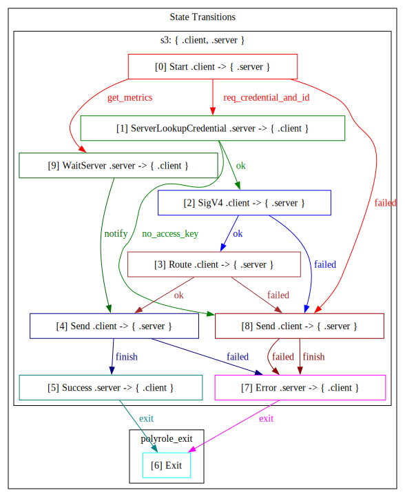

# Z3

Minimalist S3 server in Zig. No AI.

> Forked from and inspired by [zs3](https://github.com/Lulzx/zs3). Tiny binary. Focuses on simplicity.

**Do not use in production.**

## Why Z3?
- Extremely small and fast (thanks to Zig)
- Clean implementation with no AI slop
- Ideal for S3 development and testing
- Perfect for edge deployments or embedded use case

## Features
- Full AWS SigV4 authentication (compatible with `aws-cli`, `boto3`, and all major SDKs)
- Core operations: `PUT`, `GET`, `DELETE`, `HEAD`, `LIST` (v2)
- `HeadBucket` for bucket existence checks
- `DeleteObjects` for batch delete
- **Multipart uploads** for large files
- **Range requests** for streaming/seeking
- HTTP `100-continue` support

## Under Development
- Versioning, lifecycle policies, bucket ACLs
- Pre-signed URLs, object tagging, encryption

## Quick Start

```bash
# Build
zig build -Doptimize=ReleaseFast

# Run
./zig-out/bin/z3

# Options
./zig-out/bin/z3 --port=9000 --data-dir=./data --tmp=./tmp
```

Server runs on **http://localhost:9000** by default.

Data is stored in `./data`.

Default credentials (admin): `minioadmin` / `minioadmin`

### Credentials & Roles

Create credentials at runtime (`--acl=`):

```bash
./zig-out/bin/z3 --acl="admin:akey:asec,reader:rkey:rsec,writer:wkey:wsec"
```

Format: `role:access_key:secret_key`, comma-separated. Roles:

| Role   | Allowed Methods                              |
|--------|----------------------------------------------|
| admin  | all                                          |
| writer | GET, HEAD, OPTIONS, PUT, POST, DELETE        |
| reader | GET, HEAD, OPTIONS                           |

## Usage

### AWS CLI

```bash
export AWS_ACCESS_KEY_ID=minioadmin
export AWS_SECRET_ACCESS_KEY=minioadmin

aws --endpoint-url http://localhost:9000 s3 mb s3://mybucket
aws --endpoint-url http://localhost:9000 s3 cp file.txt s3://mybucket/
aws --endpoint-url http://localhost:9000 s3 ls s3://mybucket/ --recursive
aws --endpoint-url http://localhost:9000 s3 cp s3://mybucket/file.txt ./
aws --endpoint-url http://localhost:9000 s3 rm s3://mybucket/file.txt
```

### `boto3` SDK:

```python
import boto3

s3 = boto3.client('s3',
    endpoint_url='http://localhost:9000',
    aws_access_key_id='minioadmin',
    aws_secret_access_key='minioadmin'
)

s3.create_bucket(Bucket='test')
s3.put_object(Bucket='test', Key='hello.txt', Body=b'world')
print(s3.get_object(Bucket='test', Key='hello.txt')['Body'].read())
```

## Design

The z3 achitecture is built on `polyrole`, a multi-role finite state machine that models the full lifecycle of an S3 request.

Every S3 request is split into two phases, **A** and **B**:

- **A (Server):** Handle lightweight operations that need consistency guarantees — access key
  lookups, global counter increments, metrics updates, log writes. All of **A runs
  sequentially** in a single thread.
- **B (Client):** Handle heavy CPU and disk I/O tasks, including HTTP header parsing, SigV4 HMAC
  computation, file payload reads/writes, request routing, response serialization. All of
  **B operations run concurrently** across a pool of `zio` coroutines.

Under load this forms a "set of A" and a "set of B". Serializing A and parallelising
B yields the best throughput.

To achieve this, [polyrole](https://github.com/sdzx-1/polyrole) describes the full lifecycle of an S3 request as a typed
state machine. The A set executes in one OS thread; the B set executes across [zio](https://github.com/lalinsky/zio)'s
coroutine pool.

**Communication between A and B:**
- B → A: a bounded `MsgChannel` queue (capacity 1000)
- A → B: a `WaitMsg` struct written directly into B's `ClientContext`, signalled
  via `ResetEvent`

The full A–B protocol is the state machine visualised:



This pattern mirrors the **Erlang client-server model**: the server (A) is passive,
the client (B) sends messages and waits for replies.

**Pointer-based communication.** A and B pass `*ClientContext` pointers, so the
per-message cost is essentially one `ResetEvent` syscall — no copies, no
serialisation. Polyrole guarantees at compile-time that A never accesses B's
pointer after B has exited, making this safe without runtime checks.

> The bulk of the B-side code is derived from [zs3](https://github.com/Lulzx/zs3).

## Building

Requires Zig 0.16.

```bash
zig build                                    # debug
zig build -Doptimize=ReleaseFast             # release
zig build -Dtarget=x86_64-linux-musl         # cross-compile
```

## Testing

```bash
python3 test_client.py          # 24/24 integration tests (stdlib only)
python3 test_comprehensive.py   # 66/66 boto3 tests (standalone)
```

Requires `pip install boto3` for comprehensive tests.

## Benchmark

```shell
❯ zig build -Doptimize=ReleaseFast run
```

```shell
❯ python benchmark.py --only zs3

============================================================
Benchmarking: zs3
Endpoint: http://localhost:9000
Iterations: 100
============================================================
  PUT 1kb... 100 ok
  PUT 4kb... 100 ok
  PUT 64kb... 100 ok
  PUT 1mb... 100 ok
  GET 1kb... 100 ok
  GET 4kb... 100 ok
  GET 64kb... 100 ok
  GET 1mb... 100 ok
  LIST... 100 ok
  DELETE... 400 ok

============================================================
Results: zs3
============================================================
Operation             Mean     Median        P99    Ops/sec
------------------------------------------------------------
create_bucket        5.50ms      5.50ms      5.50ms      181.7
put_1kb              0.43ms      0.41ms      1.33ms     2312.9
put_4kb              0.42ms      0.41ms      0.62ms     2370.6
put_64kb             0.61ms      0.62ms      0.81ms     1627.5
put_1mb              2.99ms      2.98ms      4.37ms      334.0
get_1kb              0.35ms      0.34ms      0.79ms     2858.8
get_4kb              0.31ms      0.29ms      0.44ms     3237.5
get_64kb             0.33ms      0.33ms      0.42ms     3014.7
get_1mb              0.53ms      0.52ms      0.71ms     1885.7
list                 2.08ms      2.08ms      2.63ms      480.0
delete               0.34ms      0.33ms      0.53ms     2937.0

============================================================
Concurrent Benchmark: zs3
Endpoint: http://localhost:9000
File size: 1.0MB
Concurrency: 50 workers, 20 requests each
Total requests: 1000
============================================================
  PUT 50 files... 50 ok, 0 failed (0.07s)
  Running concurrent GET requests... 1000 ok, 0 failed

============================================================
Concurrent Results: zs3
============================================================
  --- PUT ---
  Total time:     0.07s
  Requests:       50/50 successful
  Throughput:     691.0 req/s
  Latency mean:   59.20ms
  Latency median: 59.34ms
  Latency p99:    70.64ms
  Latency min:    47.01ms
  Latency max:    70.64ms
  --- GET ---
  Total time:     0.37s
  Requests:       1000/1000 successful
  Throughput:     2731.2 req/s
  Latency mean:   16.49ms
  Latency median: 16.74ms
  Latency p99:    26.77ms
  Latency min:    0.69ms
  Latency max:    32.71ms

```


## Limits

| Limit | Value |
|-------|-------|
| Max header size | 8 KB |
| Max body size | 5 GB |
| Max key length | 1024 bytes |
| Bucket name | 3-63 chars |

## Security

- Full SigV4 signature verification (case-insensitive header matching)
- Input validation on bucket names, object keys, and upload IDs
- Path traversal protection (blocks `..` in keys, rejects absolute paths, validates multipart upload IDs)
- XML escaping on all user-supplied values in responses (keys, prefixes, continuation tokens, max-keys)
- Query parameter boundary checking (no substring false positives)
- Request size limits (8KB headers, 5GB body, 1024-byte keys)
- No shell commands, no eval, no external network calls

TLS not included. Use a reverse proxy (nginx, caddy) for HTTPS.

## License

**The MIT License**
